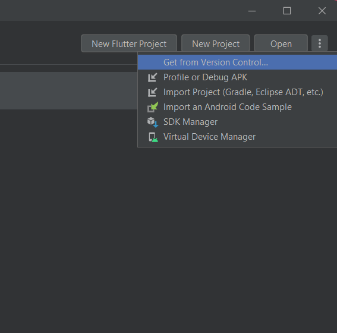

# Development Set-up
## Prerequisites
* Android phone / Android Studio (emulator)
* Visual Studio Code
* Flutter
## Instructions
1. Install `Visual Studio Code` from [here](https://code.visualstudio.com/download)
2. Install `Flutter` from [here](https://docs.flutter.dev/get-started/install)
3. Install `Android Studio` from [here](https://developer.android.com/studio?gclid=CjwKCAiA6seQBhAfEiwAvPqu156nzMl4lpk3-kmim4mwY1K-eGt4Z-edm0cNuBReFvhjSCciiHekPBoCiJwQAvD_BwE&gclsrc=aw.ds)
4. In your `Visual Studio Code` go to the extensions sidebar found on the left side or you can click **Ctrl + Shift + X** to install the Flutter extension


5. To test the application, if you are using an `Android Studio Emulator`, click on the three dots found on the upper right and select Virtual Device Manager


6. Select `Create a Device` and select the type of phone to use. Make sure that a Google Play Icon is present under the Play Store Column. Afterwards, run the device. 
  

7. At Visual Studio Code, open the terminal at the code folder and run the commands: 
```
flutter build
flutter run
```

8. Another way to run the code is by simply opening the `main.dart` file which is found under the `lib` folder. Make sure that the Android Emulator is detected on the `lower right`, before clicking the `play button` which can be found on the upper right of your screen. 


9. If you are to use an `Android Phone` instead of an android emulator, what you can do is open your visual studio code and terminal at the `root` directory and run the following commands:
```
flutter build apk --release
```
10. Wait for it to compile. Afterwards, this should show on your terminal


11. Get the apk file titled `app-release.apk` found under `build/app/outputs/flutter-apk`

12. Transfer the file anywhere on your mobile device directory and install. Given that the application is not found in playstore, a warning dialogue will show on your device saying so. In order to proceed, just click on the `more details` to show the `install anyway` option. 


13. You may now see and run the application on your device.

